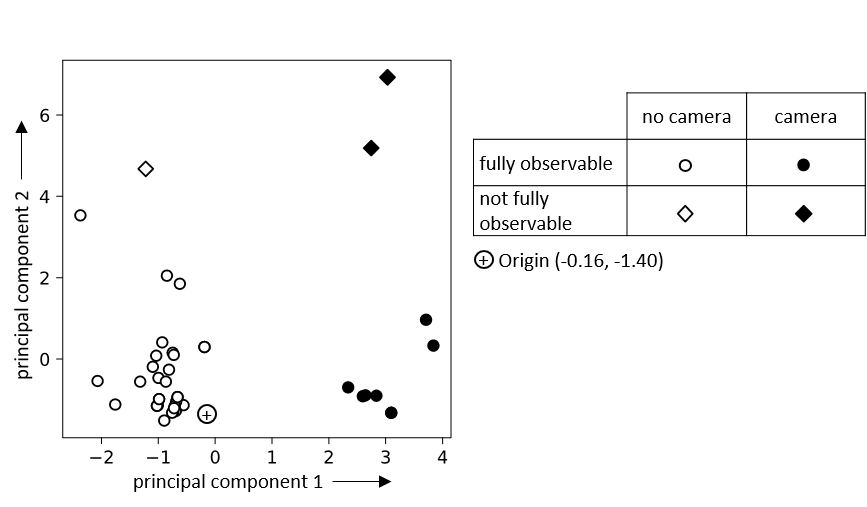
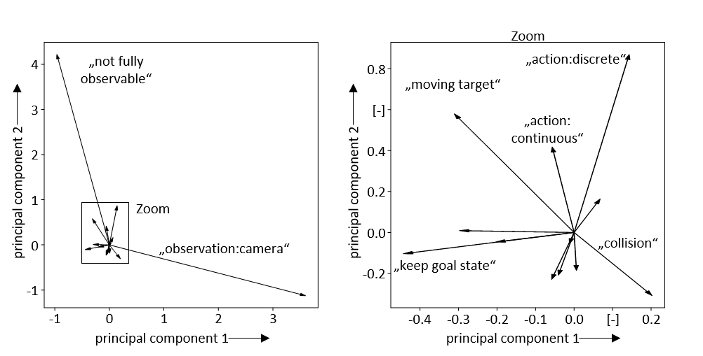
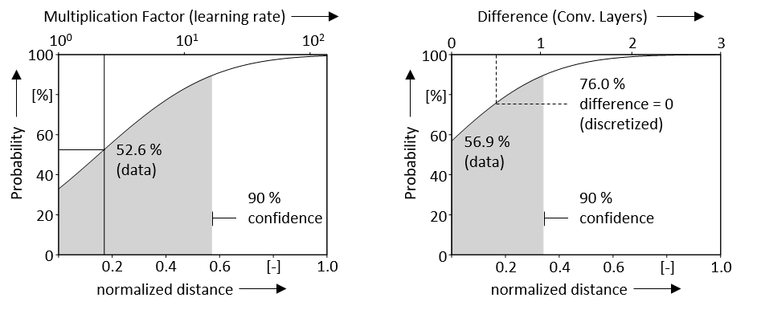
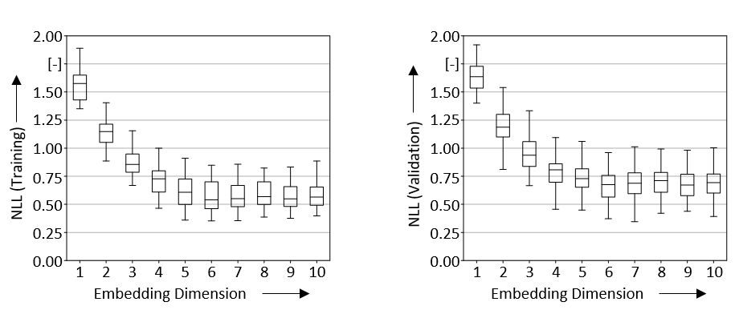
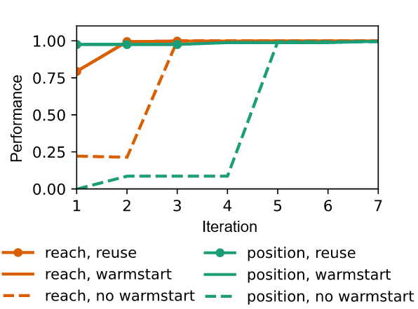

# Retrieval of Hyperparameter Configurations in Deep Reinforcement Learning based on semantic Task Descriptions

The code can be run using Binder (wait until a virtual machine is ready; "Cell"-->"Run All"):\

# Similarity Learning in Deep Reinforcement Learning (PPO)

Hyperparameter configurations are commonly chosen by adapting hyperparamter configurations of similar tasks. While the similarity of supervised learning tasks can be approximated by the similarity of the data sets and similar solutions are reused (so-called meta learning), in Deep Reinforcement Learning only an abstract description of the task exists before training.

A siamese network architecture (Retrieve.ipynb) is used to learn the similarity of semantic task descriptions with respect to the similarity of hyperparameters. The description of a task using case embeddings is composed of the embeddings of individual elements multiplied by their cardinality.

To account for uncertainties (e.g., loss of information due to task abstraction, different possible hyperparameter configurations for the same tasks), a distribution of the similarity of the hyperparameters is specified via Monte Carlo Droput (Probabilistic Layer).

# Test Scenarios
A welding process is divided into three sub-processes: reach, position and welding.

# Results
## Embeddings of different tasks (case embeddings h)
The siamese network is trained on 42 existing tasks and the respective hyperparameter configurations.

## Embeddings of semantic elements (word embeddings)
As can be assumed, the observability and the sensor technology used have a high influence, since these allow a direct decision regarding the architecture. 

## Uncertainty
The figure shows the uncertainty in the similarity of two cases in which different hyperparameters are used for the same task. As can be seen from the example of the learning rate, some uncertainty is also found due to the robustness of the RL approach with respect to the hyperparameter selection (e.g. different learning rates).

## Influcence of embedding dimensionality
While 10 embedding dimensions have been used, further experiments (100 trials per dimension) show similar results for embeddings dimensions as low as 6.

## Reuse of similar hyperparamter configurations in bayesian optimization
The figure shows how the reuse of similar hyperparameter configurations speeds up the bayesian optimization. In the test scenarios, only a small improvement in performance is achieved by the further optimization. Therefore, an evaluation of the feasibility of the task can already take place here through a simple reuse of existing solutions.

